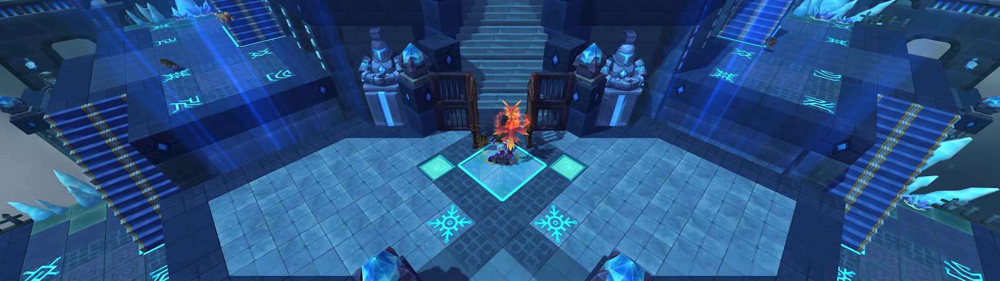
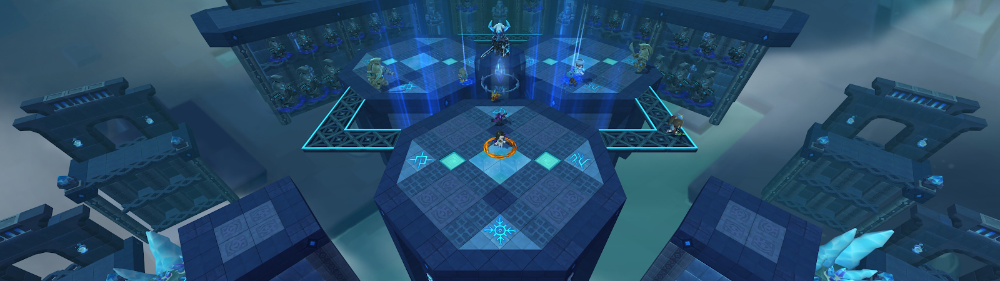
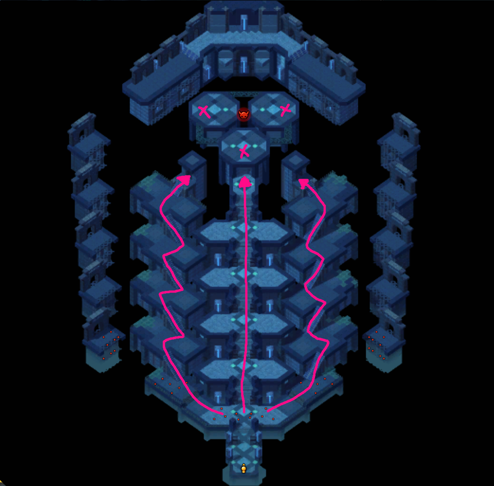

# Frospillar Temple [Bjorn] | 서릿발 신전  [비에른]

## Disclaimer
All these informations were gathered by watching videos from:

- [꼬냑e](https://www.youtube.com/channel/UCqMFhYyqigbQtbcVSAB77QQ)
- [Leegun](https://www.youtube.com/channel/UCD94DsmjjiF3rwSPDMoPvQw)

and practicing the raid first-hand.

Special thanks to [Shank](https://twitch.tv/shsr) for proofreading.  
Special thanks to [Helen](https://www.twitch.tv/dear) for translating [this video](https://youtu.be/Rui6GXuRMWQ) that I used as reference for this guide.

---

**For those who already know the mechanics and only want to learn pattern, here’s the compact version:**

WIP

---

Paragraphs that start with the word “**META**” are just explaining one way to do things. You don’t have to follow it. (Sort of like dodging left during panic phase in Papulatus).

## Table of contents

1. Screenshots
2. Buffs and debuffs
3. Mechanics
4. Phases
    1. Floor 1~5
    2. Phase 1 (100%)
    3. Phase 2 (70%)
    4. Phase 3 (40%)
    5. Phase 4 (15%)

## Screenshots

**Floor 1**

**Floor boss**

## Buffs and debuffs

## Mechanics

## Phases

### Floor 1~5
There will be 3 paths that lead to the Bjorn. Left, middle, and right. After defeating the adds at Floor 5, a portal will spawn and it will teleport players to the platform (marked with X in the picture below) where Bjorn is.

Kill all adds on each floor to unlock the access to the next floor.

Tip: There are more adds in the middle path, so ideally you want to have the party split up 3 left / 4 middle / 3 right.

### Phase 1 (100%)
### Phase 2 (70%)
### Phase 3 (40%)
### Phase 4 (15%)