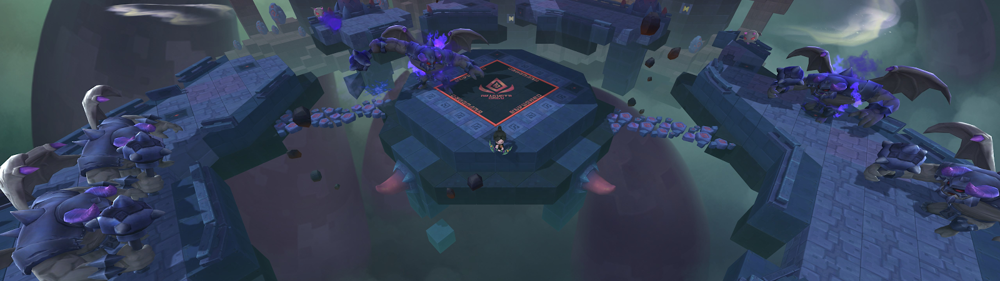
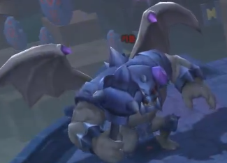
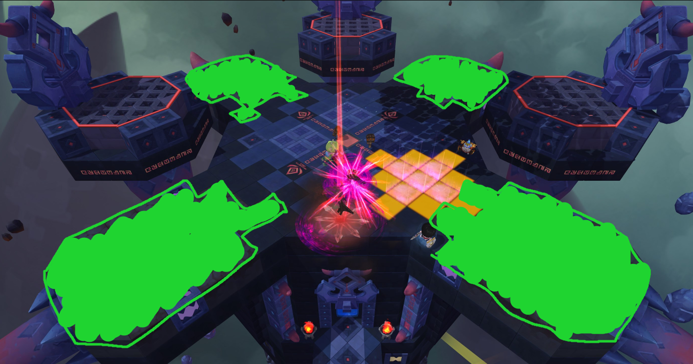
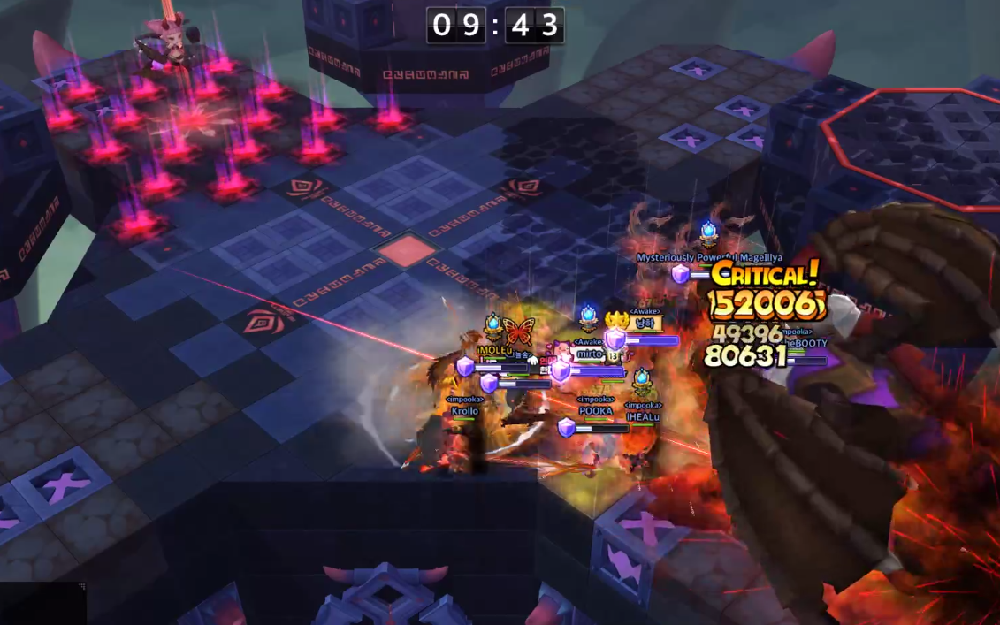

# Madrakan Spire [Lukarax] | 마드라칸 첨탑 [루카락스]

## Disclaimer

All this information was gathered by watching videos from:

- [iAMAZEu & iSHOOTu MS2](https://www.youtube.com/channel/UCBlv0d_yNyHozdobM3aG7yQ)
- [꼬냑e](https://www.youtube.com/channel/UCqMFhYyqigbQtbcVSAB77QQ)
- [Leegun](https://www.youtube.com/channel/UCD94DsmjjiF3rwSPDMoPvQw)

and practicing the raid first-hand.

Special thanks to [Shank](https://twitch.tv/shsr) for proofreading.

---

**For those who already know the mechanics and only want to learn pattern, here’s the tl;dr version:**

**Floor 1~3**  
Kill all Kabals to spawn the ladder that leads to the next floor.

**Phase 1 (100%)**  
Lukarax will keep cycling through the same attacks until Phase 2.

**Phase 2 (60%)**  
Lukarax flies to bottom left corner and prepares to take off and fly up to Floor 5. Grab onto it to fly up with it.

Lukarax will keep attacking with Yellow tiles until it goes back to Floor 4.
Madria will keep attacking with Gravity bomb until Lukarax goes back to Floor 4.

Lukarax will go back to Floor 4 if any of the following happens:
- Lukarax’s HP drops to 25%.
- Madria’s HP drops to 1%.

Once Lukarax is back on Floor 4, it will keep cycling through the same attacks until Phase 3.

**Phase 3 (19%)**  
Lukarax pushes everyone back and stuns them for 2 seconds.

Madria applies Shadow Flame buff to Lukarax.
Attack Madria to drop her HP down to 1% to remove buff from Lukarax.
Once she’s at 1% HP, she summons a circle with poisonous gas and jumps away.

Lukarax will keep cycling through the same attacks until 0% HP.

---

**Accuracy required:**  
- 111 will be roughly 99.6% hit rate.
- 114 is 100% hit rate.

Paragraphs that start with the word “**META**” are just explaining one way to do things. You don’t have to follow it. (Sort of like dodging left during panic phase in Papulatus).

## Table of contents

1. Screenshots
2. Buffs and debuffs
3. Mechanics
    1. Monto
    2. Kabal
    3. Gyatus
    4. Lukarax
    5. Madria
4. Phases
    1. Floor 1
    2. Floor 2
    3. Floor 3
    4. Phase 1 (100%) Floor 4
    5. Phase 2 (60%) Floor 5 and Floor 4
    6. Phase 3 (19%) Floor 4

## Screenshots

**Floor1**

**Floor2**

**Floor3**

**Floor4**

**Floor5**

## Buffs and debuffs

Enemy buffs

Name | Icon | Description | Duration
--- | --- | --- | ---
Shadow Flame (Kabal) |  | Increases defense by 80%. Increases attack by 30%. | 4 seconds
Shadow Flame (Lukarax) |  | Inflicts Shadow Burning on hit. Increases defense by 75%. | 4 minutes or until Madria gets weakened

Debuffs

Name | Icon | Description | Duration | Who gets it?
--- | --- | --- | --- | ---
Shadow Burn |  | Inflict continuous fire damage. Decreases accuracy by 18%. Stacks up to 5 times. | 9 seconds | Whoever gets hit by the purple flame shot by Monto
Deadly Shadow Toxin |  | Reduces physical and magic attack by 99%. Inflicts poison damage every second. | As long as you stand on a corrupted tile | Whoever is standing on a corrupted tile

## Mechanics

**Monto**

**Kabal**

**Gyatus**

### Monto

1. Give Shadow Flame buff to Kabals  
Animation: Monto shoots out a purple light that hits the Kabal.

2. Purple flame  
What it does: inflict damage and apply 1 stack of Shadow Burn debuff  
How to dodge: move away from the purple flame  
Animation: Monto shoots out a purple flame that travels on a straight line.

### Kabal

1. Dash swing  
What it does: inflict damage to enemies up to 6 blocks in front  
How to dodge: move away from Kabal's front  
Animation: Kabal winds up his mace, slams the ground twice, and then swing forward 6 blocks.

2. Swing  
What it does: inflict damage to enemies up to 2 blocks in front  
How to dodge: move away from Kabal's front  
Animation: Kabal winds up his mace twice and then swing while staying on the same block.

3. Fissure  
What it does: inflict damage in a straight line up to 4 blocks in front  
How to dodge: move away from Kabal's front  
Animation: Kabal moves his left arm forward.

4. Gravity hand (only certain Kabals can do this)  
What it does: pull enemies towards his left hand (does no damage). After that, it will wind up his mace for 1 second and then swing forward, damaging any enemies in front  
How to dodge: move away from Kabal's front *after* it stops pulling

### Gyatus

1. Purple flame  
What it does: inflict damage and apply 1 stack of Shadow Burn debuff  
How to dodge?: move away from the purple flame  
Animation: Gyatus shoots out a purple flame that travels on a straight line.

### Lukarax

1. Dash  
What it does: Lukarax runs forward 15 blocks 5~6 times (always towards an enemy) and inflict damage to any enemy in front of it. It will always stay still for one second after each run.  
How to dodge?: move away from his front.  
Animation: Lukarax claws with its left paw 4 times and then runs forward.

2. Flame breath  
What it does: inflict damage to enemies in the fire and apply 1 stack of Shadow Burn.  
How to dodge?: move away from the fire.  
Animation: Lukarax stands up with purple fire in its mouth and shoots out flame in a cone-shaped area twice. **It will always start from Lukarax’s left and then right.**

3. Wing attack  
What it does: Inflict damage while pushing enemies back 5 blocks twice (total of 10 blocks).  
How to dodge?: You can cancel the push back with abilities that give you super-armor. Alternatively, you can jump during the pushback animation to cancel it partially. If you dash early enough, you can move away from the cone-shape area that gets affected by the pushback.  
Animation: Lukarax stands up and flaps its wings.

Example of dodging the pushback

4. Flamethrower  
What it does: inflict damage and apply 1 stack of Shadow Burn debuff . It will leave a trail of purple gas which will explode and deal damage after 1 second. This explosion will most likely one-shot you.  
How to dodge?: move away from the flame.  
Animation: Lukarax tilts its head down and then shoot flame in a narrow straight line.

5. Yellow tiles  
What it does: They are like Devokar’s yellow tiles. Tiles will turn yellow and inflict damage after 1 second.  
How to dodge?: move away from yellow tiles.

6. Jump  
What it does: Lukarax jumps up and inflict damage when it lands.  
How to dodge?: move away from the landing area. You can also grab onto it when it jumps and let go right before it lands.  

### Madria

1. Gravity bomb  
What it does: Madria throws a purple ball at an enemy. When the ball lands, it will start pulling enemies towards it, damaging anyone at the center of the pull.  
How to dodge?: move away from it.

2. Yellow tiles that spawn purple flame after exploding  
What it does: Spawns purple flames on the yellow tiles. If you step on the purple flame, you will get 1 stack of Shadow Burn .  
How to dodge?: move away from yellow tiles and/or purple flames.

## Phases

### Floor 1

Kill all 5 (2 left, 1 middle, 2 right) Kabals to spawn the ladder that leads to Floor 2.

Tips:

- As long as the **middle** Kabal is alive, the two Montos will always respawn.
- Killing the middle Kabal will **also** kill the two Montos on this floor.
- Montos will only give Shadow Flame buff to the upper three Kabals (highlighted with pink in the screenshot).

### Floor 2

Kill all 3 (1 left, 1 middle, 1 right) Kabals to spawn the ladder that leads to Floor 3.

Tips:

- There’s a total of 10 Montos. 2 on the left, 6 in the middle, and 2 on the right.
- As long as the **left/middle/right** Kabal is alive, the Montos on the left/middle/right **respectively** will always respawn.
- Killing the left/middle/right Kabal will **also** kill the Montos on the left/middle/right **respectively**.
- Left and right Montos will give Shadow Flame to left and right Kabal respectively.
- Middle Montos will give Shadow Flame to middle Kabal. Depending on proximity, they can also give Shadow Flame to either left or right Kabal.

### Floor 3

Kill all 3 (1 left, 1 middle, 1 right) Kabals to spawn the ladder that leads to Floor 4.

Tips:

- There’s a total of 7 Montos.
- As long as the **left/middle/right** Kabal is alive, the 3 left/1 middle/3 right Montos **respectively** will always respawn.
- Killing the left/middle/right Kabal will also kill the 3 left/1 middle/3 right Montos respectively.
- 3 left/3 middle/3 right (no, it’s not a typo. I meant 3/3/3) Montos will give Shadow Flame buff to left/middle/right Kabal **respectively** on this floor.

### Phase 1 (!00%) Floor 4

**Your objective is to kill Lukarax, not Madria.**

NOTE: Madria will occasionally throw **Yellow tiles that spawn purple flame after exploding** as long as Lukarax is on Floor 4. This is her only attack when Lukarax is on Floor 4. This will persist throughout the entire fight.

The four corners that Lukarax can fly to.

The area shaded in green has corrupted tiles that give you Deadly Shadow Toxin.

Lukarax will repeat this pattern in the same order until Phase 2:

1. Use Dash once or twice (usually twice).
2. Fly to one of the four corners.
3. Attack 4~6 times. Attacks can be any of the following:
    - Flame Breath
    - Wing attack
    - Flamethrower

NOTE: Whenever Lukarax flies to one of the four corners, Madria will always position herself at the opposite corner and summon **purple flames** at that corner.

### Phase 2 (60%) Floor 5 and Floor 4

Lukarax flies to bottom left corner and prepares to take off and fly to Floor 5.  
**Grab onto Lukarax** to fly up with it. **Be careful not to fall off of Floor 5!**

Madria will now occasionally throw the **Gravity bomb** as long as Lukarax is on Floor 5.  
Lukarax will keep using **Yellow tiles** as long as it’s on Floor 5.

**META 1**: Leave one player behind on Floor 4 to draw Madria’s aggro. That player needs to stay close to Madria. This will reduce the chances of Madria throwing the Gravity bomb to Floor 5 and will instead throw it at the player on Floor 4.

**META 2**: Optionally, if the party has a healer, everyone can go up to Floor 5 and just heal through the **Gravity bomb** instead of dodging it.

**If you are on FLOOR 4 while Lukarax is on Floor 5, Madria can sometimes AOE stun the entire FLOOR 4. Be careful! Lukarax might throw a Yellow tile to FLOOR 4 after Madria’s stun. The stun lasts for 7 seconds.**

**If you are at Floor 4 during this Phase, make sure to avoid the stun (Knight’s Bulwark, Thief’s Blade Dance, Safe Riding, etc…) and dodge the Yellow tiles after the stun. Madria will have a yellow circle around her when she’s about to stun.**

Lukarax will come back down to Floor 4 if one of the following happens:

- Lukarax’s HP drops to 25%.
- Madria’s HP drops to 1%.

When Lukarax comes back to Floor 4, it will keep attacking until Phase 3.  
Attacks can be any of the following:
- Dash
- Jump
- Flies to a corner -> Attack twice. Attacks can be any of the following:
    - Flame Breath
    - Flamethrower

NOTE: When Lukarax is at **22% HP**, Madria will summon **purple flames** that applies one stack of Shadow Burn, scattered around in the middle of the platform. These flames will last for exactly **60 seconds.**

### Phase 3 (19%) Floor 4

Lukarax roars. It will inflict damage to everyone, push them back, and stun them for 2 seconds. The knock back can be cancelled if you have super-armor during the stun (e.g. Soul Binder’s Soul Shield).

Madria will apply Shadow Flame buff to Lukarax.

Attack Madria to drop her HP down to 1% to **remove** the buff from Lukarax.

When Madria’s HP drops down to 1%, she will summon a circle with poisonous gas before jumping away to the left platform and **will stop attacking for the rest of the fight**. The poison will inflict damage every second and it covers almost the entire Floor 4.

The circle is big enough that if you stand outside of it, you’ll be standing on a corrupted tile.

Lukarax will keep attacking until 0% HP. Attacks can be any of the following:

- Dash
- Jump
- Flies to a corner -> Attack twice. Attacks can be any of the following:
    - Flame Breath
    - Flamethrower