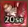
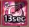

# Temple of Time [Pink Bean] | 이계의 존재 [핑크빈]

## Disclaimer

Information was gathered by watching videos from:

- [iAMAZEu & iSHOOTu MS2](https://www.youtube.com/channel/UCBlv0d_yNyHozdobM3aG7yQ)
- [꼬냑e](https://www.youtube.com/channel/UCqMFhYyqigbQtbcVSAB77QQ)
- [Leegun](https://www.youtube.com/channel/UCD94DsmjjiF3rwSPDMoPvQw)

and practicing the raid first-hand.

Special thanks to [Helen]() for translating [this video](https://youtu.be/mVQjTCnYqiQ) that I used as reference for this guide.  
Special thanks to [Shank] for proofreading.  
Special thanks to Taco for providing some information.

---

**For those who already know the mechanics and only want to learn pattern, here’s the tl;dr version:**

**Phase 1 (100%)**  
Kill 1st and 2nd wave of adds. Kill statue 1 and 5.  
Pink Bean (PB) applies reverse debuff and keeps attacking until Phase 2.

**Phase 2 (85%)**  
PB gets on his pogo stick and applies a reverse debuff. Lure PB to either (left or right) speaker to stun (8 seconds) it and remove its invincibility buff so that you can damage it.

PB attacks 0~2 times and then gets back on its pogo stick.

PB gets back on its pogo stick and applies the reverse/music debuff. Lure PB to the other speaker to once again remove its invincibility buff and then damage it..

After recovering from the second stun by the second speaker, PB will blow its whistle and stun targets in front of it.

Statues 1, 2, 4 and 5 spawn. Kill them.

PB keeps attacking until Phase 3.

**Phase 3 (65%)**  
PB will jump to the upper left platform and apply music debuff.

Kill statue(s) ASAP then attack PB. NOTE: Focus statue 3 **FIRST** and then clean up the other statue (either 1 or 5). Statue 3 will place Damage Reflect (DR) on PB if it’s not killed fast enough.

PB will keep jumping from platform to platform until Phase 4.

PB will always attack 3~5 times before jumping to another platform.

PB will always apply music or reverse debuff when jumping to another platform.

**Phase 4 (40%)**  
Same as Phase 2.

**Phase 5 (15%)**  
Kill all statues. Climb up ladder. Kill PB.

---

Paragraphs that start with the word “**META**” are just explaining one way to do things. You don’t have to follow it. (Sort of like dodging left during panic phase in Papulatus).

## Table of contents

1. Screenshots
2. Buffs and debuffs
3. Mechanics
    1. Statue 1 and 5
    2. Statue 2 and 4
    3. Statue 3
    4. PB
4. Phases
    1. Phase 1 (100%)
    2. Phase 2 (85%)
    3. Phase 3 (65%)
    4. Phase 4 (40%)
    5. Phase 5 (15%)

## Screenshots

## Buffs and debuffs

Enemy buffs

Name | Icon | Description | Duration
--- | --- | --- | ---
Defense |  | Increase defense by 70% | Until statue 1 and 5 are dead
Enlarged |  | Increase attack by 30% and defense by 70% | Until statue 2 and 4 are dead
Reflect |  | Reflects all damage and increases defense by 99% | Phase 1~4 (PB): Until statue 3 is dead. Phase 1~4 (Statue 2 and 4): If a player is within 2 blocks from the statue. Phase 5: until all statues are dead
Invincibility |  | Blocks all attacks | Until PB is stunned

Debuffs

Name | Icon | Description | Duration | Who gets it?
--- | --- | --- | --- | ---
Accuracy |  | Decrease accuracy by 30%. Stacks up to 3 times. | 9 seconds | Whoever gets hit by orange circle or lightning
Electrified |  | Inflict continuous damage to the player and other players around | 15 seconds | Whoever gets hit by lightning
Attack down |  | Reduce attack by 50%. Inflict continuous damage to the player | 15 seconds | Whoever is closest to statue 1 or 5
Item Healing Reduction |  | Reduces the effects of healing items by 50%. Inflicts continuous curse damage | 20 seconds | Everyone
Dance |  | Makes the player dance. Unable to use any skill. | 3 seconds | Whoever steps on purple tile or if you're next to someone with Music debuff (if you don't also have the Music debuff)
Music |  | Applies ance debuff to surrounding players if they don't also have the Music debuff. | 15 seconds or 20 seconds (depends on the phase) | 3 random players
Reverse |  | Makes your directional keys go to the opposite direction | 20 seconds | 4 random players

## Mechanics

Statue 1, 2, 3, 4, and 5

### Statue 1 and 5

1. Give Defense buff to PB
2. Lightning  
What it does: Inflict damage and apply Accuracy debuff  and Electrified debuff.  
How to dodge?: Move away from the blue circle.  
Animation: Statue 1 or 5 will open the book and lightning will strike down. A blue circle will spawn, followed up by a lightning strike on the blue circle.  

3. Spikes.   
What it does: Inflict damage when spikes come out.  
How to dodge?: Move out of beige tiles.  
Animation: Statue 1 or 5 will stab sword into ground and make a bunch of tiles change into beige color. After 2 seconds, spikes will come out from the ground.

4. Give Attack Down debuff.  
How to dodge?: Can’t.  
Animation: Statue 1 will cast a yellow circle in front of it and shoot a yellow ball to the target.

### Statue 2 and 4

1. Give Reflect buff  to itself if there’s any player within 3 blocks from it. Which means only range class should kill them.

2. Give Enlarged buff to PB.
3. Falling stone.  
What it does: inflict damage.  
How to dodge?: move away from the small cube stone.  
Animation: Statue 2 or 4 will have their eyes and wings glowing. A small cube stone will spawn on the same block as the targeted enemy. A giant stone will follow up and fall from the sky.

### Statue 3

1. Give Item Healing Reduction debuff.  
How to dodge?: Can’t.  
Animation: Statue 3 will summon 2 green Stirge.

2. Give Reflect buff to PB.  
Animation: Statue 3 will cast a purple circle.

3. Falling rock.  
What it does: inflict damage.  
How to dodge?: move away from yellow circle.  
Animation: A yellow circle will spawn, followed up by the falling rock.

4. Poison.  
What it does: release poisonous gas at specific areas of the dungeon. If you stand inside that area, you will take continuous damage.  
How to dodge: move away from it.  

The area shaded in pink will be covered in poison. Only one area (upper or lower) can be poisoned at a time

### Pink Bean

1. Yoyo [YOO YOO RING RING VROOM VROOM](https://clips.twitch.tv/ResoluteGloriousLasagnaPupper)  
What it does: pulls enemies towards yoyo. Yoyo will inflict damage on you if you’re close to it. When PB retracts the yoyo, it will knock down whoever is standing in between PB and the yoyo. PB will then teleport to a random location.  
How to dodge?: Walk or dash away from yoyo. Can use PB’s body as bodyblock to prevent you from being pulled into yoyo. Alternatively, PB retracts the yoyo after ~9 seconds. You can DPS him and move out of the way when he’s close to retracting the yoyo.

2. Roll  
What it does: PB rolls around and inflict damage on enemies in front. When PB is speeding up, you can still damage it, but it will block all attacks including debuffs when it’s actually rolling.  
How to dodge?: You can dodge the roll if you time your jump correctly.

NOTE: Roll’s hitbox will keep going even if PB’s body is stuck (just like Captain Moc’s dash attack).

3. Beam  
What it does: Inflict damage and apply Accuracy debuff . Note: This debuff can actually stack. i.e. getting hit with multiple accuracy beams will continue to decrease your hit rate.  
How to dodge?: Move away from orange circle.  
Animation: PB starts dancing and orange circle will spawn, followed up by the Beam.

4. Megaphone  
What it does: Apply Dance debuff  on enemies inside the purple area.  
How to dodge?: Move away from purple area.

5. Apply Music debuff.  
How to dodge?: Invisibility Potion/Lingering Ghost/Dark Cloak.  
Animation: Pink Bean shoots out 𝄞 sign.

Example of using Dark Cloak to dodge Music debuff

Example of making someone Dance  if they don’t have Music debuff . Notice that iMOLEu has the Music debuff and Elisan doesn’t

6. Apply Reverse debuff .  
How to dodge?: Invisibility Potion/Lingering Ghost/Dark Cloak.  
Animation: Pink Bean shoots out ! sign.

Example of using Dark Cloak to dodge Reverse debuff

## Phases

### Phase 1 (100%)

PB will initially be sitting at statue 3 and occasionally apply Music or Reverse debuff.

1st wave: PB will spawn statue 1, 5 and adds.

Kill adds. (There is no reason to kill statue 1 and 5 at this point because they will regen back to full HP on the 2nd wave.)

2nd wave: PB will re-spawn statue 1 and 5 (if they were killed), and adds again.

Kill statue 1, 5 and adds.

PB jumps down from statue 3.

PB takes out a remote control, teleports to a corner and apply Reverse debuff.

PB jumps 1~5 times to these 4 spots randomly.

PB will now keep attacking until Phase 2. Attacks can be any of the following:

- Yoyo
- Roll
- Megaphone
- Reverse debuff (with the remote control)
- Jump

### Phase 2 (85%)

PB jumps back to statue 3.

Two speakers will appear (left and right). Surrounding the speakers, there will be purple tiles that will make you Dance if you step on it (Safe Riding can allow you to move while Dancing).

PB jumps down from statue 3. There’s a few seconds window when PB jumps down where you can attack before PB gets Invincibility buff.

PB gets a Invincibility buff and gets on a Pogo stick.

PB applies Reverse debuff.

Lure PB towards the speaker. When PB steps on the speaker, Invincibility will be removed and PB will be stunned for 8 seconds.

PB will now attack 0~2 times. Attacks can be any of the following:

- Megaphone
- Beam

PB jumps back to north corner and gets back on Pogo stick

PB gets Invincibility buff again and applies Reverse or Music debuff..

Lure to the other speaker and then attack when Invincibility is removed.

When PB recovers from the stun, PB will randomly target a player and blow a whistle that will stun enemies standing in front of it.

Statue 1, 2, 4 and 5 will spawn. Kill them to remove buff from PB.

**META**: At this stage, ideally there should be one player staying with PB to hold aggro so PB won’t attack players killing the statues.

When all statues are dead, PB will keep attacking until Phase 3. Attacks can be any of the following:

- Beam
- Roll
- Yoyo
- Jump
- Megaphone

### Phase 3 (65%)

PB jumps to upper left platform (always) and apply Music debuff.

Note:  
If PB is on the upper left platform, statue 1 and 3 will spawn.  
If PB is on the upper middle platform, statue 3 will spawn.  
If PB is on the upper right platform, statue 3 and 5 will spawn.

**META**: Players with Music debuff should climb up with the right ladder and kill statue 3.  
Everyone else climbs up with the left ladder and kill statue 3.  
One player that climbed up with the left ladder should stay with PB to hold aggro while the rest kills statue 1 and 3. If no one is next to PB, it will constantly cast Beam.

PB will attack 3~5 times before jumping to another platform. Attacks can be any of the following:

- Megaphone
- Beam
- Roll

PB will always apply Music or Reverse debuff when jumping to another platform.

**META**: When PB jumps east (left to middle, left to right, or middle to right), players with debuff stay on the left side (highlighted in pink) of statue 3 and then kill statue 3. Everyone else stay on the right side. Again, one player stay with PB to hold aggro.
 

When PB jumps west, players with debuff stay on the right side (highlighted in pink) of statue 3 and then kill statue 3. Everyone else stay on the left side. Again, one player stay with PB to hold aggro.

Why?

- Players with Music debuff will have to travel less distance to hit statue 3, making it less likely to cause other players to Dance accidentally.
- Players with Reverse debuff will have to travel less distance to hit statue 3, making it less likely to fall down from upper platform. Climbing up the ladder with Reverse debuff can be difficult if you’re not used to it.

This also means that players with debuff will be the farthest away from PB, making it less likely to be targeted by attacks, therefore they don’t have to dodge as much. (It’s difficult to dodge if you have Reverse debuff).

PB will keep jumping from platform to platform until Phase 4.

### Phase 4 (40%)

PB jumps back to statue 3.

Same as Phase 2.

### Phase 5 (15%)

PB jumps back to statue 3.

PB will get a Reflect buff unless all statues are dead. PB will occasionally apply Music debuff.

Kill all statues to remove Reflect buff from PB.

**META**: Everyone climbs up the ladder and kill statue 3. When statue 3 is dead, everyone comes down and kill statue 1, 2, 4 and 5 (in no particular order).

Tip: If PB is standing next to either statue 2 or 4, range classes can hit the statue from this position without attacking PB (because PB will still have Reflect buff).

PB will jump up to upper middle platform when all statues are dead.

PB spawns 5 purple tiles that will make you dance if you step on it.

PB applies Music debuff throughout this Phase.

**META**: players with Music debuff stay on the left side of the platform. Everyone else stays right side.

PB will keep attacking until 0% HP. Attacks will alternate between Beam and Megaphone, starting with Beam first.